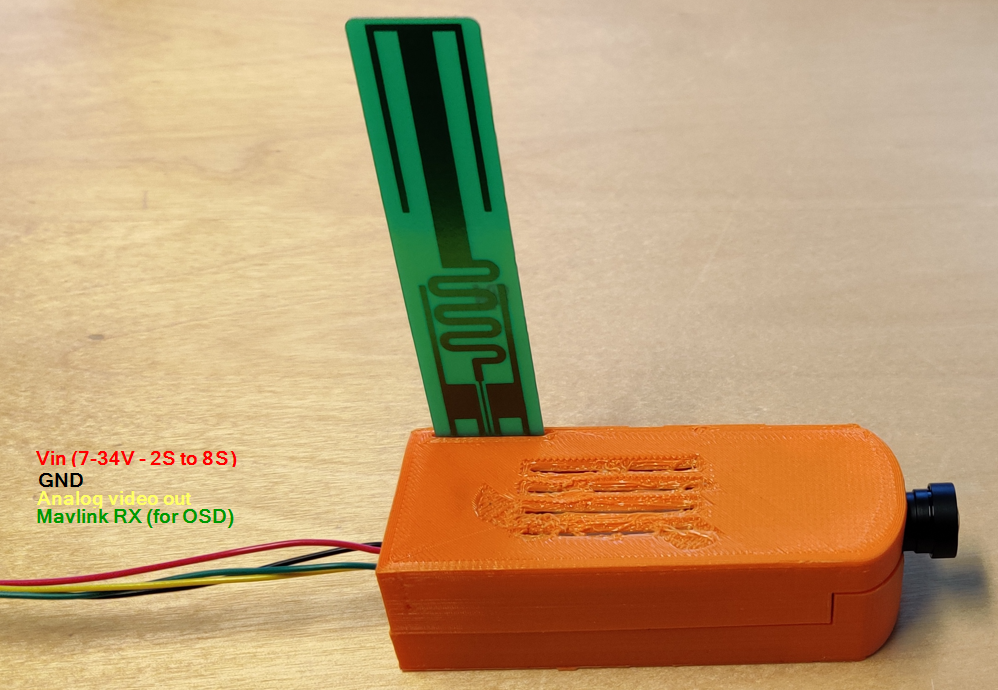
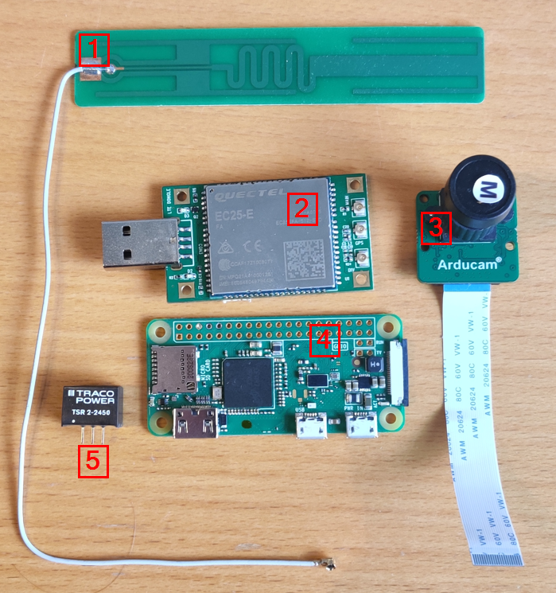
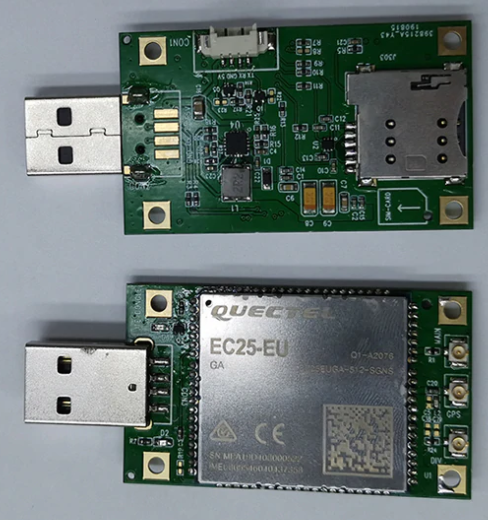
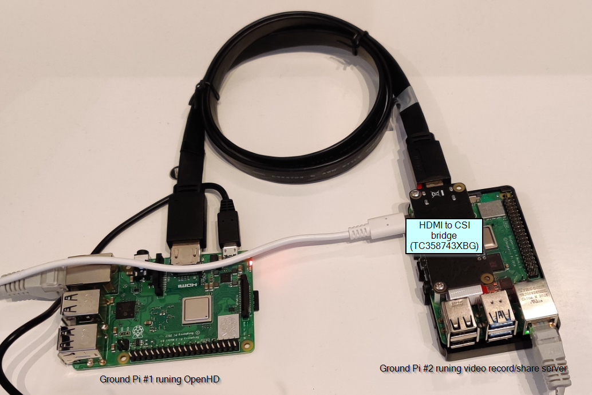
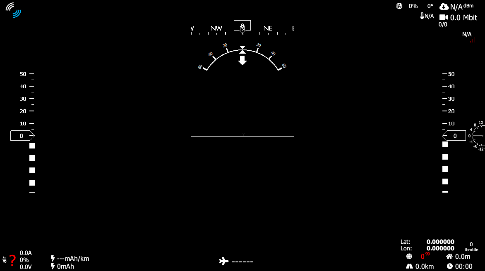
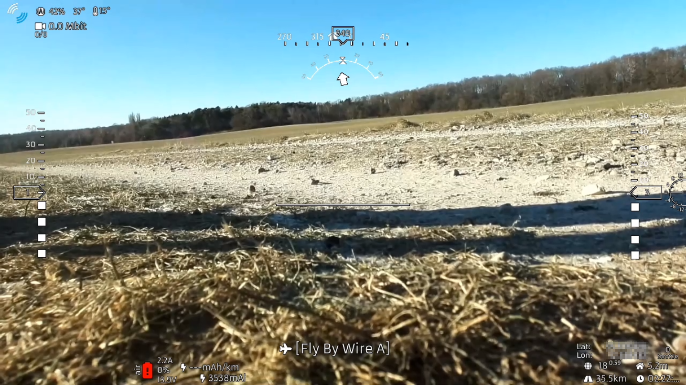

# Mavlink Ardupilot Telemetry and HD video via LTE (4G):

# Introduction
This is based on my project [MavlinkGPRS](https://github.com/KenLagoni/MavlinkGPRS) flying with 2G telemetry link, but this time I want to ad HD video streaming also and thus stepping up to 4G (LTE).

The hardware is build from standard components and put together with som 3d-printing to give the camera a "Run-Cam" look.

# Features:
- Record video up to 1920p30 / 720p60.
- Stream video to groundstation via 4G LTE network. (Lagenchy ~0.7s).
- Output analog video.
- Input Mavlink telermetry for digial OSD using the [OpenHD](https://github.com/OpenHD/Open.HD) 
- Camera size: 103x35x28mm (not including antenna).
- Groundstaiton shares video feed via RTSP protocol using the [rtsp-simple-server](https://github.com/aler9/rtsp-simple-server) project.

# Air Hardware (Drone side):
For instructions on how to setup air side see [here](https://github.com/KenLagoni/OpenHD-LTE/tree/main/air).  
The air side consist of the following hardware:

1. PCB antenna 4G - Manufacture: Siretta Partnumber: ECHO14/200M/UFL/S/S/15 
2. 4G LTE usb modem with Quectel EC25 module. The model depend on your contry. It can be bought [here](https://www.aliexpress.com/item/10000267232403.html?spm=a2g0o.productlist.0.0.56b14f97JY5Pu9&algo_pvid=744aa925-ca3d-471f-b6da-6f4c6571b23b&algo_exp_id=744aa925-ca3d-471f-b6da-6f4c6571b23b-7&pdp_ext_f=%7B%22sku_id%22%3A%2220000000157105585%22%7D)
3. [Arducam B0262](https://www.arducam.com/product/arducam-12mp-imx477-mini-high-quality-camera-module-for-raspberry-pi/) Camera including flex cable.
4. Raspberry pi Zero.
5. Input PSU, Manufature: TRACO Partnumber: [TSR 2-2450](https://www.digikey.com/en/products/detail/traco-power/TSR-2-2450/9383726?s=N4IgTCBcDaICoGUBKACMBaMAWArABhAF0BfIA)

#### The LTE (4G) modem:
In order to get the highest bandwidt possible with LTE, a Cat. 4 modem (150Mbps/50Mbps Down/Up) must be used. This gives a maximum max upload of 50mbps and depending on the video settings, a maximum of ~10Mbps should do.
Currently I use the Quectel EC25-E because i live in the EU. These can be found on Aliexpress for around ~$50 in a fairly small formfactor where I can use my own external antenna.

#### Raspberry Pi Zero:
Currently testing with Raspberry Pi Zero, and by using the CSI-2 interface and onboard HW video encoder I get 1920x1080 30fps without any problems. The total CPU usages is arround 20-30% inkl. the program which handles data transmission.
The Pi uses the lates Buster image with this program installed.

#### The Camera:
Well the standard Raspberry Pi camera v1 and v2 are not very good, but they can be used. I currently use a [Arducam B0262](https://www.arducam.com/product/arducam-12mp-imx477-mini-high-quality-camera-module-for-raspberry-pi/) it is the same image sensor IMX477 as the new raspberry pi HQ camera, but the formfactor is smaller (same as RPI CAM v1/v2) and more importantant, the Lens can be swapped for a wide ranges of [M12 Lenses](https://www.arducam.com/?s=LK001).

# Ground Hardware (Ground side):
At the moment the ground station consists of two Raspberry pi's. One for receieving and displaing video with OSD (from the [OpenHD](https://github.com/OpenHD/Open.HD) project) and one which records the HDMI output and makes the video available to multiple clients via RTSP, based on the [rtsp-simple-server](https://github.com/aler9/rtsp-simple-server) project.

1. Raspberry pi 3b+ as groundstation running OpenHD buster v2.0.8 with modification. See here for [setup](https://github.com/KenLagoni/OpenHD-LTE/tree/main/ground-OpenHD).  
2. Raspberry pi 3b+/4 as groundstatin recorder and video server. See here for [setup](https://github.com/KenLagoni/OpenHD-LTE/tree/main/ground-VideoRecord).  

#### OSD (OpenHD/QOpenHD):
The OSD is just very nice, and it can easilly be costemizes on the fly using the mouse, see more [Here](https://github.com/OpenHD/Open.HD):
OSD without video:

OSD and video:

# How to Build
Start with the ground pi for recording, since it is needed on the network to install the air side.\
-For instructions on how to create the ground-side OpenHD SD card see [Here](https://github.com/KenLagoni/OpenHD-LTE/tree/main/ground-OpenHD)
-For instructions on how to create the air-side SD card see [Here](https://github.com/KenLagoni/OpenHD-LTE/tree/main/air).  
-For instructions on how to create the ground-side SD card see [Here](https://github.com/KenLagoni/OpenHD-LTE/tree/main/ground-VideoRecord)